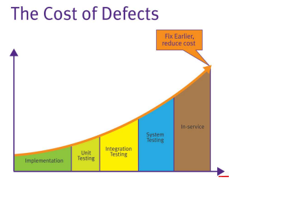
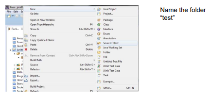
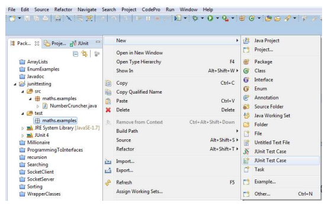
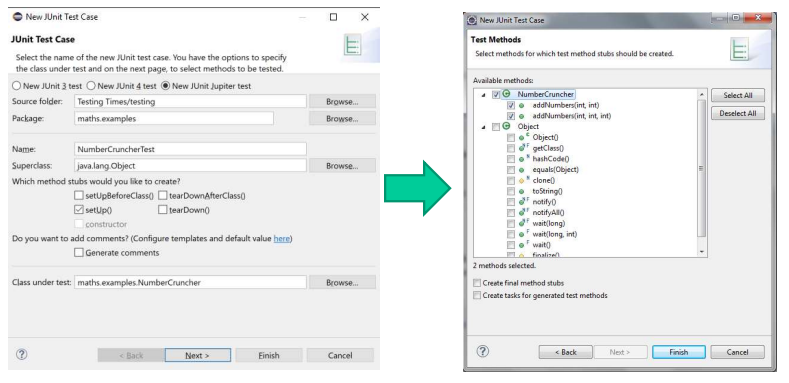
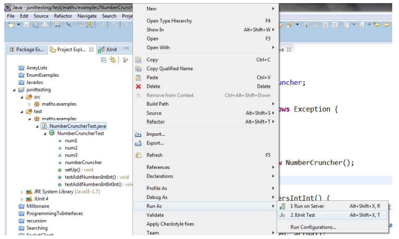
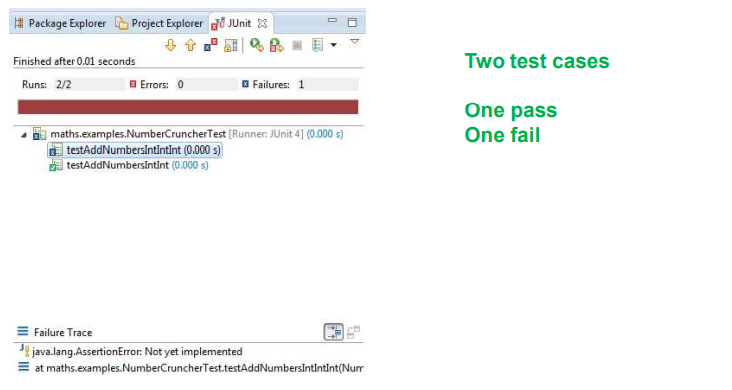
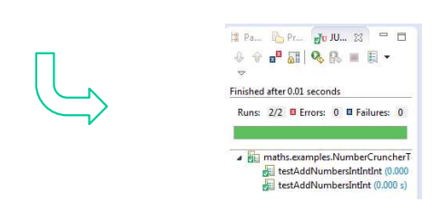

# CSC7081---Programming
## Testing

> Week 17 focuses on Testing (Unit Testing, JUnit Testing).

# JUNIT Testing

- JUnit is a unit testing framework for the Java  programming language.

- JUnit is important in the development of test-driven development (TDD) and is one of a family of unit testing frameworks collectively known as xUnit.

# Black box and White box testing 

- Black-box testing treats the software as a black box, focusing solely on inputs and outputs.

- White-box testing, testers use their knowledge of the system internals when testing the system. For example with White-box testing the testers have access to the source code.

- Both compliment each other, Black-box ensures an application covers system requirements.

- White-box is used to test each method / function has proper test cases available.

# Testing Levels

- Testing is performed at all levels of the Software development lifecycle.

- Testing levels are defined by where the testing takes place within the course of the SDL.

    - Unit Testing
    - Integration Testing
    - System Testing
    - Acceptance Testing
    - Regression Testing

# Unit tests and unit testing

- A unit test is a piece of code written by a developer that executes a  specific functionality in the code which is tested. The percentage of code which is tested by unit tests is typically called test coverage.

- A unit test targets a small unit of code, e.g. a method or a class.

- Unit tests ensure that code works as intended. They are also very helpful to ensure that the code still works as intended in case you need to modify code for fixing a bug or extending functionality.

- Having a high test coverage of your code allows you to continue developing features without having to perform lots of manual tests.

# Integration testing

- Accessing the interface between the software components.

- May be performed incrementally as the components are being develop, or as a “big bang” when the components are ready to work together.

- Incremental Integration Testing reduces risk and increases stakeholders’ confidence.

- May also involve testing a component’s interaction with an external system. E.g. if the system relies on a web service for data…

# System Testing

- The overall testing of the system.

- At this point all components are developed and are working together and within any external systems.

# User Acceptance Testing (UAT)

- Performed by customers.

- Generally two levels

    - Alpha testing : performed by limited group of users. Good opportunity for customers to have an early view of the product and gather feedback. Alpha releases may miss some features and lacks some non functional attributes such as performance.

    - Beta testing : product is released to a wider audience of customers. Beta release may be very close to the final product but development teams may still be working on improving performance or fixing known defects.

# Regression testing

- As defects are reported and fixed it is important to ensure each new fix does not break anything that was previously working.

- With each new fix the testers will run a battery of regression tests to make sure that each functionality that was known to work correctly is still working.

# Catch it early !



# Testing - Java Projects

- Test organisation for Java projects

    - Typically unit tests are created in a separate project or separate source folder to avoid normal code and the test code is mixing.

- What should you test?

    - 100% test coverage ?
    - All complex code ?
    - Getters and setters ?

# Testing with JUnit

- JUnit in version 4.x is a test framework which uses annotations to identify methods that specify a test. Typically these test methods are contained in a class which is only used for testing. It is typically called a Test class.

- JUnit assumes that all test methods can be executed in an arbitrary order. Therefore tests should not depend on other tests.

- To write a test with JUnit you annotate a method with the @Test annotation and use a method provided by JUnit to check the expected result of the code execution versus the actual result.

# Running a JUnit Test in Eclipse

```
public class NumberCruncher {

    /**
     * Method adds two numbers and returns the result
     * @param num1
     * @param num2
     * @return
     */
     public int addNumbers(int num1, int num2) {
         return num1+num2;
     }

     /**
     * Method adds two numbers and returns the result
     * @param num1
     * @param num2
     * @param num3
     * @return
     */
     public int addNumbers(int num1, int num2, int num3) {
         return num1+num2+num3;
     }
}
```

# Package Structure for Unit testing


- Creating the structure

    - Creating the source folder

        


    - Creating the package structure with the new test folder

        

    - Creating the JUnit Test class

        

    - Creating the JUnit Test class

        

# JUnit Test Class

```
package maths.examples;

import static org.junit.jupiter.api.Assertions.*;

import org.junit.jupiter.api.BeforeAll;
import org.junit.jupiter.api.BeforeEach;
import org.junit.jupiter.api.Test;

class NumberCruncherTest {
	
	// test data
	int num1, num2, num3;
	NumberCruncher numberCruncher;

	@BeforeAll
	static void setUpBeforeClass() throws Exception {
	}

	@BeforeEach
	void setUp() throws Exception {
		num1 = 4;
		num2 = 6;
		num3 = -3;
		numberCruncher = new NumberCruncher();
	}

	@Test
	void testAddNumbersIntInt() {
		int expected = 10;
		int actual = numberCruncher.addNumbers(num1, num2);
		assertEquals(expected, actual);
	}

	@Test
	void testAddNumbersIntIntInt() {
		int expected = 7;
		int actual = numberCruncher.addNumbers(num1, num2, num3);
		assertEquals(expected, actual);
	}

}
```

# JUnit Test Class - Running



# Test Run Output



# Exercise I - Implement the failing test case

```

```



# Annotations used by JUnit (5)

```
---------------------------------------------------------------------------------------------------------
                            | Description
---------------------------------------------------------------------------------------------------------
@Test                       | The annotation @Test identifies that a method is a test method. 
public void method()        |
---------------------------------------------------------------------------------------------------------
@BeforeEach                 | Will execute the method before each test. This method can prepare
public void method()        | the test environment (e.g. read input data, initialise the class).
---------------------------------------------------------------------------------------------------------
@AfterEach                  | Will execute the method after each test. This method can cleanup the 
public void method()        | test environment (e.g. delete temporary data, restore defaults).
---------------------------------------------------------------------------------------------------------
@BeforeClass / @BeforeAll   | Will execute the method once, before the test cases are ran.
public void method()        |
---------------------------------------------------------------------------------------------------------
@AfterClass / @AfterAll     | Will execute the method once, after all tests have finished. This can be 
public void method()        | used to perform clean-up activities, for example to disconnect from a 
                            | database.
---------------------------------------------------------------------------------------------------------
@Ignore / @Disabled         | Will ignore the test method. This is useful when the underlying code 
                            | has been changed and the test case has not yet been adapted. Or if 
                            | the execution time of this test is too long to be included.
---------------------------------------------------------------------------------------------------------
Some Annotation Tags have been replaced/renamed between JUnit 4 and 5. 
Both versions shown here.
---------------------------------------------------------------------------------------------------------
```

# Assert statements

- JUnit provides static methods in the Assert class to test for certain conditions.

- These assertion methods typically start with assert and allow you to specify the error message, the expected and the actual result.

- An assertion method compares the actual value returned by a test to the expected value, and throws an AssertionException if the comparison test fails.

```
-------------------------------------------------------------------------------------------------------------
Statement                                  | Description
-------------------------------------------------------------------------------------------------------------
fail(String)                               | Let the method fail. Might be used to check that a certain part
                                           | of the code is not reached. Or to have failing test before the
                                           | test code is implemented.
-------------------------------------------------------------------------------------------------------------
assertTrue(true) / assertTrue(false)       | Will always be true / false. Can be used to predefine a test 
                                           | result, if the test is not yet implemented. 
-------------------------------------------------------------------------------------------------------------
assertTrue([message], boolean condition)   | Checks that the boolean condition is true.
-------------------------------------------------------------------------------------------------------------
assertsEquals(expected, actual)            | Tests that two values are the same. Note: for arrays the 
                                           | reference is checked not the content of the arrays. 
-------------------------------------------------------------------------------------------------------------
assertsEquals(expected, actual, tolerance) | Test that float or double values match. The tolerance is 
                                           | the number of decimals which must be the same. 
-------------------------------------------------------------------------------------------------------------
assertNull([message], object)              | Checks that the object is null.
-------------------------------------------------------------------------------------------------------------
assertNotNull([message], object)           | Checks that the object is not null.
-------------------------------------------------------------------------------------------------------------
assertSame([String], expected, actual)     | Checks that both variables refer to the same object. 
-------------------------------------------------------------------------------------------------------------
assertNotSame([String], expected, actual)  | Checks that both variables refer to different objects.
-------------------------------------------------------------------------------------------------------------
```

# Characteristics of a Good Unit Test

- Runs fast.
    - If the tests are slow, they will not be run often

- Separates or simulates environmental dependencies such as databases, file systems, networks, queues and so on.

- Is very limited in scope.
    - If the test fails, it's obvious where to look for the problem. Use few Assert calls so that the offending code is obvious.  It's important to only test one thing in a single test.
    
- Clearly reveals its intention.
    - Another developer can look at the test and understand what is expected of the production code.

- Runs and passes in isolation.
    - If the tests require special environmental setup or fail unexpectedly, then they are not good unit tests. Change them for simplicity and reliability. Tests should run and pass on any machine. The "works on my box" excuse doesn't work.
    
- Often uses stubs and mock objects.
    - If the code being tested typically calls out to a database or file system, these dependencies must be simulated, or mocked. These dependencies will ordinarily be abstracted away by using interfaces.

# Exercise II

- Add another two new methods to the Number Cruncher class that multiplies 2 and 3 numbers respectively.

- Update the NumberCruncherTest class to include unit test for the two new methods.

- Run the new test cases.

- Rerun all the test cases.

## assertEquals(double, double, delta)

```
public double divNumbers(double num1, double num2) {
    return num1/num2;
}

@Test
public void testDivide() {
    double expected = 3.33;
    assertEquals(expected, nc.divNumbers(10.0, 3.0), 0.1) // Delta (0.1): The maximum delta between expected and actual for ehich both numbers are still considered equal.
}
```

# Testing for an exception

- This method will throw an exception if the second parameter passed is a zero. This functionality can be tested using JUnit.

```
/**
 * Method to divide the first supplied parameter by the second
 * @param num1
 * @param num2 - cannot be zero
 * @return
 * @throws Exception - throws exception if 2nd parameter is a zero
 */
public int divideNumbers(int num1, int num2) throws Exception {
    if (num2 == 0) {
        throw new Exception();
    } else {
        return num1/num2;
    }
}
```

- Firstly a test case for the normal case (non zero).

```
@Test
public void testDivideNumbers() {
    int num1D = 6;
    int num2D = 3;
    int expected = num1D/num2D;
    int actual = 0;
    try {
        actual = numberCruncher.divideNumbers(num1D, num2D);
        assertEquals(expected, actual);
    } catch (Exception e) {
        e.printStackTrace();
    }
}
```

# Testing for an exception - (JUnit 5)

- Then a test for the exception case.

```
@Test
void testDivideNumbersExceptionExpected() {
    Exception exception = assertThrows(Exception.class, () -> {
        numberCruncher.divideNumbers(4, 0);
    });
}
```
Note the use of lambda expressions here ! More of those to come later in the course…

# Testing Getters and Setters

```
public class Employee {

    private String name;

    /**
     * @return the name
     */
    public String getName() {
        return name;
    }

    /**
     * @param name the name to set
     */
    public void setName(String name) {
        this.name = name;
    }
}
```

```
public class EmployeeTest {
    
    @Before
    public void setUp() throws Exception {
    }

    @Test
    public void testName() {
        String expected = "Aidan";
        Employee employee = new Employee();
        employee.setName(expected);
        String actual = employee.getName();
        assertEquals(expected, actual); // It is possible to combine the tests for set and get. 
    }

}
```

# Exercise III - Getters & Setters & Constructors

- Add another field to the employee class, int age

- Add the getter and setter for this field - valid ages are 18 to 30 inclusive)

- Create a test cases for this field.

- Now create a constructor that accespts the name and age.

- Create test cases to test this constructor functionality.

# Exercise Case Statement IV - Test Coverage

- User story – “As a user I want to be able to pass a month value 1-12 into the system and be returned as a string the name of the month. E.g. 7 = July” – Write a Java program to implement this functionality.

- You should use a switch statement.

- Test all possible code paths with JUnit Test cases.

- Default return (invalid number passed into the function) has been agreed to be a Number Format Exception. 

# assertTrue(boolean) – an example
```
/**
* Method takes a seed value and creates an int array sized by the number passed (with
* each previous number * seed) eg given 2 and 4 would return an array of [2,4,8,16]
*
* @param seed
* @param number
* @return
*/
public int[] doubleUp(int seed, int number){ // Method to be tested

    int[] nums = new int[number];
    nums[0] = seed;

    for (int loop = 1; loop < number; loop++) {
        nums[loop] = nums[loop - 1] * seed;
    }
    return nums;
}
```

```
@Test
public void testDoubleUp(){
    int seed = 2;
    int number = 4;
    int[] expected = {2,4,8,16};

    NumberCruncher numberCruncher = new NumberCruncher();
    int[] actual = numberCruncher.doubleUp(seed, number);

    System.out.println(Arrays.toString(actual));
    boolean match = true;
    // checking the values of the actual are the same as the expected
    for (int loop = 0; loop < expected.length; loop++){
        if (expected[loop] == actual[loop]){
            match = true;
        } else {
            // not a match
            match = false; // set flag to false
            break;
        }
    }
    // overall result
    assertTrue(match); // Testing requires checking each value. Only if all values are found to be the same will the test case pass.
}
```

# Testing the contents of an ArrayList

- Using the Employee class as an example of building a utility search method...

```
/**
* Searches a list of employees by age and returns all found below the specified age
* @param employees
* @param age
* @return
*/
public static ArrayList<Employee> getAllEmployeesByAge(ArrayList<Employee> employees, int age) {
    ArrayList<Employee> employeesWithAge = new ArrayList<Employee>();

    for (Employee employee : employees) {
        if (employee.getAge() <= age) {
            // found an employee - adding to list
            employeesWithAge.add)(employee);
        }
    }

    // Return the list
    return employeesWithAge;
}
```
# Testing the contents of an ArrayList

- Checking the contents of the returned ArrayList from the method

```
@Test
void testGetAllEmployeesByAge() {

    // invoke the search
    ArrayList<Employee> returnedSearchByAge = EmployeeAdmin.getAllEmployeesByAge(employees, 27);

    // should return two employees
    System.out.println(returnedSearchByAge.size());

    // could check the numbers returned and the exact object matches
    if (returnedSearchByAge.size()==2 && returnedSearchByAge.contains(employee1) && returnedSearchByAge.contains(employee2)) {
        assertTrue(true);
    } else {
        assertTrue(false);
    }

    // or 
    assertTrue(returnedSearchByAge.size()==2 && returnedSearchByAge.contains(employee1) && returnedSearchByAge.contains(employee2));
}
```

# Testing an Abstract class

- Best tested through the public API of the concrete implementations.

- In this case, testing ID (getSet) is via the Employee implementation

```
// UML
Person
- ID : int
Getters and setters

Employee
- name: String etc..
Getters and setters etc..
```

```
@Test
void testGetSetID() {
    // testing the concrete Employee class - not person
    Employee employee = new Employee();
    employee.setID(ID);
    assertEquals(ID, employee.getID());
}
```

# Testing a class with instance var of type Enum

```
public enum Department {
    SALES, PRODUCTION
}
```

```
public class Employee extends Person {

    private String name;
    private int age;

    private Department department;

    public Department getDepartment() {
        return department;
    }

    public void setDepartment(Department department) {
        this.department = department;
    }
}
```
- No need for invalid test cases – enum in setter restricts the input to the enum types
```
@Test
void testDepartment() {
    Employee employee = new Employee();
    employee.setDepartment(Department.SALES);
    assertEquals(Department.SALES, employee.getDepartment());

    employee.setDepartment(Department.PRODUCTION);
    assertEquals(Department.PRODUCTION, employee.getDepartment());
}
```

# Unit Testing System.out.println()

- Normally you separate out Logic and UI (we normally return a value from a method (test that) and then present to the UI)

- But if you are interested.. https://www.baeldung.com/java-testing-system-out-println

- Note: this topic is for general interest and does not appear on any assessments