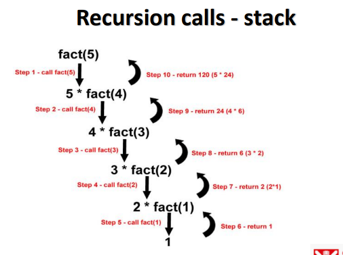
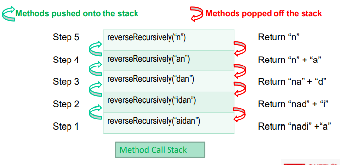

# CSC7081---Programming
## Recursion

> Week 23 focuses on recursion.

# Recursion - Introduction

 - The programs you developed so far are generally structured as methods that call one another in a hierarchical manner. 

 - For some problems, it’s useful to have a method call itself.

 - A method that does so is known as a recursive method.

# Caution : Recursion – a method calling itself

```
public class  RecursionExample {

    public static void main(String[] args) {
        callMe();
    }

    /**
     * Method that outputs message to screen then calls itself
     */
    public static void callMe() {
        System.out.println("Call Me Please...");
        callMe();
    }
}
```

# Problem solve - exercise

 - How many calls did it take until the StackOverflowError exception was thrown!

 - Update the code to track the calls

 ```
 public static void main(String[] args) {
    callMe(1);
 }

 public static void callMe(int callNumber) {
    System.out.println("Call me please "+callNumber);
    callMe(++callNumber); // recursive call !!!!
}
```

# Recursive problem-solving - elements in common

- When recursive method is called to solve a problem, it actually is capable of solving only the simplest case(s), or base case(s). 

- If the method is called with a base case, it returns a result.

- If the method is called with a more complex problem, it typically divides the problem into two conceptual pieces—a piece that the method knows how to do and a piece that it does not know how to do. 

- To make recursion feasible, the latter piece must resemble the original problem, but be a slightly simpler or smaller version of it.

- Because this new problem looks like the original problem, the method calls afresh copy of itself to work on the smaller problem—this is referred to as a recursive call and is also called the recursion step.

- The recursion step normally includes a return statement, because its result will be combined with the portion of the problem the method knew how to solve to form a result that will be passed back to the original caller.

- For the recursion to eventually terminate, each time the method calls itself with a simpler version of the original problem, the sequence of smaller and smaller problems must converge on a base case. When the method recognises the base case, it returns a result to the previous copy of the method. A sequence of returns ensures until the original method call returns the final result to the caller.

# Countdown

```
public static void countDown(int num) {

    // check base case
    if (num <= 0) {
        // base case
        System.out.println();
    } else {
        System.out.print(num);
        countDown(num-1);
    }
}
```

# Factorial

- The classic example of recursion is the computation of the factorial of a number. The factorial of a number N is the product of all the whole numbers between 1 and N. 

- Factorial!

    - Example: 4! is shorthand for 4 x 3 x 2 x 1

    - The factorial function (symbol:!) means to multiply a series of descending natural numbers. Examples:

    - 4! = 4 x 3 x 2 x 1 = 24

    - 7! = 7 x 6 x 5 x 4 x 3 x 2 x 1 = 5040

    - 1! = 1

- Factorial – with iteration

```
public class FactorialIteration {

    public int factorial(int n) {
        int result = n;
        for (int loop = n-1, loop > 1, loop--) {
            result *= loop;
            System.out.println("Result update: " + result);
        }
        return result;
    }

    public static void main(String[] args) {
        FactorialIteration factorialIteration = new FactorialIteration();
        System.out.println("Factorial 5! : " + factorialIteration.factorial(5));
    }
}
```

- Factorial – with recursion

```
public class Factorial {

    /**
     * Recursive method that solves factorial values
     * @param n
     * @return
     */
    public int factorial(int n) {
        int result;
        if(n==1) {
            // base case
            return 1;
        }
        // recursive call
        result = fact(n-1)*n;
        return result;
    }

    public static void main(String[] args) {
        Factorial fact = new Factorial();
        System.out.println("Factorial 5! : " + fact.factorial(5));
    }
}
```

- Or even less lines of code

```
    // even less lines of code !
    public static void main(String[] args) {
        System.out.println(fact(4));
    }

    public static int fact(int num) {
        // base case 
        if (num==1) {
            return 1;
        }
        return num * fact(num-1);
    }
```

# Recursion calls - Stack



# Reverse a string – Iterative approach

```
    public static void main(String[] args) {
        String something = "aidan";
        String reverseIteratively = reverseIterativey(something);
        System.out.println("Reverse Iteratively: " + reverseIteratively);
    }

    /**
     * Iterative method to reverse a string
     * 
     * @param str
     * @return
     */
    public static String reverseIterativey(String str) {
        StringBuilder strBuilder = new StringBuilder();
        char[] strChars = str.toCharArray();

        for (int i = strChars.length - 1; i >= 0; i--) {
            strBuilder.append(strChars[i]);
        }
        return strBuilder.toString();
    }
```

# Reverse a string – Recursive approach

```
    /**
     * Recursive call to reverse a string
     * 
     * @param str
     * @return
     */
    public static String reverseRecursively(String str) {
        System.out.println("In with: " + str);
        // base case to handle one char string and empty string
        if (str.length() <= 1) {
            System.out.println("BASE CASE REACHED");
            return str;
        }
        return reverseRecursively(str.substring(1)) + str.charAt(0);
    }

    public static void main(String[] args) {
        String something = "aidan";
        String reverseRecursively = reverseRecursively(something);
        System.out.println("Reverse Recursively: " + reverseRecursively);
    }
```

- Under the hood ..



# Iteration vs. Recursion

- Any problem that can be solved recursively can also be solved iteratively (non-recursively). 

- A recursive approach is normally preferred over an iterative approach when the recursive approach more naturally mirrors the problem and results in a program 
that is easier to understand and debug.

- A recursive approach can often be implemented with fewer lines of code. Another reason to choose a recursive approach is that an iterative one might not be apparent.

- Recursion has many negatives. 
    
    - It repeatedly invokes the mechanism and consequently the overhead, of method calls. This repetition can be expensive in terms of both processor time and memory space.

    – Each recursive call causes another copy of the method (actually, only the method’s variables, stored in the activation record) to be created—this set of copies can consume considerable memory space. Since iteration occurs within a method, repeated method calls and extra memory assignment are avoided.

- Avoid using recursion in situations requiring high performance. 

- Recursive calls take time and consume additional memory.

- Recursion is commonly used for sorting and searching lists.

# Exercise - Recursion

- Create a recursive method to repeatedly ask a user for a number between a range 1 – 10. 

- Then output to screen starting at the user’s validated value up to 100.

- Use another recursive method to do this...

```
package Week23;

import java.util.Scanner;

public class RecursionExercise {

    private static Scanner scanner = new Scanner(System.in);
    private static int number = 0;

    public static void main(String[] args) {
        System.out.println("Welcome");
        checkRange();
        System.out.println("You entered .." + number);
        countUp(number);
    }

    public static void countUp(int num) {
        // check base case
        if (num == 101) {
            // base case
            System.out.println();
        } else {
            System.out.println(num);
            countUp(num + 1);
        }
    }

    public static void checkRange() {
        System.out.println("Please enter a number between 1 and 10");
        number = scanner.nextInt();
        // check base case - i.e. number is between 1 - 10
        if (number > 0 && number < 11) {
            // base case
            System.out.println("Number OK");
        } else {
            checkRange();
        }
    }

}
```
# Exercise - Reverse a list

- Given the arraylist nums, create a recursive method that will reverse the order of the values in the arraylist..

```
ArrayList<Integer> nums = new ArrayList<>();
nums.add(12);
nums.add(89);
nums.add(99);

System.out.println(nums.toString());
reverse(nums);
System.out.println(nums.toString());
```

```
/**
 * Recursive method that enables reversal of given arraylist
 * Strips the first element of the arraylist (and stores it locally in the method)
 * Then calls itself and does the same again until then arraylist is empty
 * It then unwinds the call stack - returning to each previous method on the call stack adding the locally stored value 
 * to the arraylist. 
 * 
 * eg first call [12, 89, 99] strips the 12 
 * second call [89,99] strips the 89
 * third call [99] strips the 99
 * fouth call is the base case 
 * 
 * next the call stack unwinds 
 * the 99 is added to the array [99]
 * then the 89 is added [99, 89] 20
 * then the 12 is added [99, 89, 12] 
 * @param arrayList
 * @return
 */
 public static ArrayList<Integer> reverse(ArrayList<Integer> arrayList) {
    if(arrayList.size() > 1) { 
        Integer value = arrayList.remove(0); // remove and store locally the first element
        reverse(arrayList); // recursive call with smaller arraylist
        arrayList.add(value); // when the call stack returns here add local store of the first element to the array
        // as the call stack unwinds it continually adds the elements to the array 
    }
    return arrayList; 
 }
```

- 8 Queens Problem... Look this up!