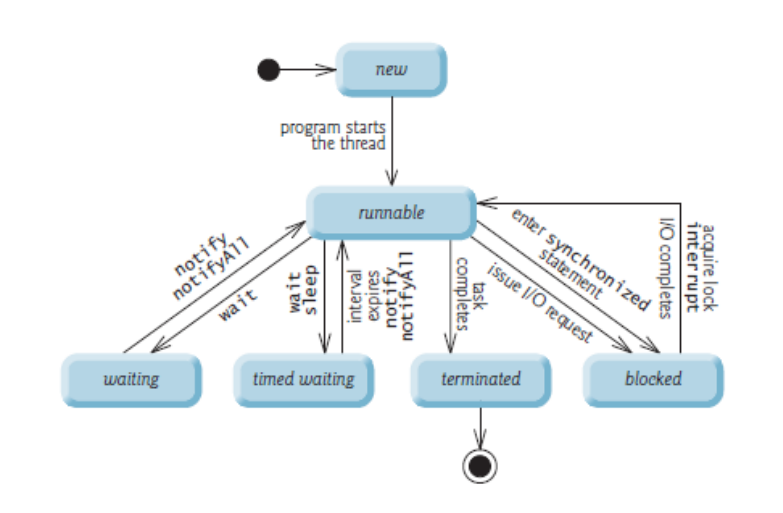

# CSC7081---Programming
## Threads

> Week 24 focuses on threads / multi-tasking.

# Multitasking - What are Threads?

- Before answering this ..

- Multitasking – general term referring to ability to perform more that one task simultaneously.

- Multiprocessing – ability to run more than one process at a time. (e.g. running a web browser and a word processer at the same time)

- Multithreading – performing multiple functions within the same process. (e.g. running a web browser (a process) and using it to send an email, download a file and upload another at the same time). This would be three threads within one process.

- Primary difference between Multiprocessing and Multithreading is that each process maintains a separate data set, whereas multiple threads can work on the same 
data set.

- Multithreading is very efficient. Less taxing on operating system to maintain multiple threads rather than multiple processes. 

# Types of Threads in Java

- Daemon Threads 
    - created by the JVM
    - Designed to run in background to service User Threads
    - e.g. Garbage collector

- User Threads
    - Created by the user
    - e.g. the Main thread, launched in the :
        public static void main(String[] args) method.
    - From this method you will launch all other Threads

# Creating Threads

Two main ways to do it in Java…
1. Subclass the Thread class
2. Implement the Runnable interface

- Subclassing the Thread class

    - Java has a class called Thread. By extending this class you get all it’s functionality.

    ```
    package ThreadsExamples;

    public class ExtendingThreadExample extends Thread {

    }
    ```

    - This class is a valid Thread but does nothing. You need to add a run method.

    - The JVM expects to find the code intended to be executed as part of the Thread in the run method.

- Subclassing the Thread class

    - The Thread class implements the Runnable interface.
    - The only method declared in Runnable is Run.
    - So at this point you need only to Override the Run method to implement your Threaded code.
    - To start the Thread you call start() not run()
    - run() method is what is executed by the thread after you call start().

    ```
    public class ExtendingThreadExample extends Thread {

        // Inderits the start() method from the Thread class
        @Override
        public void run() {
            do {
                System.out.println("My first thread.... running away....");
            } while(true);
        }
    }
    ```

    ```
    package ThreadsExamples;

    public class ExtendingThreadTest {
    
        public static void main(String[] args) {

            ExtendingThreadExample ete = new ExtendingThreadExample();
            // start the Thread
            ete.start();
            do {
                System.out.println("Main thread. Running away....");
            } while(true);

        }
    }
    ```

    - Output, This will vary each time the class runs…

    ```
    My first thread.... running away....
    My first thread.... running away....
    Main thread. Running away....
    Main thread. Running away....
    My first thread.... running away....
    My first thread.... running away....
    Main thread. Running away....
    Main thread. Running away....
    My first thread.... running away....
    My first thread.... running away....
    Main thread. Running away....
    Main thread. Running away....
    ```

# Implementing the Runnable interface

- Remember Java supports only single class inheritance.
- Extending Thread restricts your class.
- Better to implement an Interface…
- Bypass the Thread class (which implements the Runnable interface) and implement Runnable yourself.

```
package ThreadsExamples;

public class ImplementingRunnableExample implements Runnable {

    @Override
    public void run() {
        do {
            System.out.print("My second thread...running away...");
        } while(true);
    }

}
```

- But, you don’t have the start method anymore (that’s part of the Thread class).
- Answer – the Thread class takes as an argument in it’s constructor an Object of type Runnable. 
- By passing your class which has the run method (that implements runnable) to the Thread class you can delegate the Thread class to do some work for you… in this case use it’s start(). (Example of The Delegation Design Pattern in OO)

```
package ThreadsExample;

public class ImplementingRunnableTest {

    public static void main(String[] args) {

        // create the class with the run method
        ImplementingRunnableExample ire = new ImplementingRunnableExample();

        // pass the run class into a Thread class
        Thread newThread = new Thread(ire);

        // start the Thread via the newThread class
        newThread.start();
        do {
            System.out.println("Main thread. Running away...");
        } while(true);

    }

}
```

# Naming of Threads

When you create a thread you can give it a name. The name can help you distinguish different threads from each other. For instance, if multiple threads write to System.out it can be handy to see which thread wrote the text.

```
public class ThreadOutputsName implements Runnable {

    @Override
    public void run() {
        String name = Thread.currentThread().getName();
        System.out.println("Thread " + name + " started");
    }
}
```

```
package ThreadsExamples;

public class ThreadNames {

    public static void main(String[] args) {
        ThreadOutputsName nameThread = new ThreadOutputsName();
        // pass to Thread class and name it too
        Thread thread = new Thread(nameThread, "My Wee Thread");
        thread.start();
    }
}
```

// Thread My Wee Thread started

# Starting multiple threads

```
public class ThreadOutputsName implements Runnable {

    public int number = 0;

    @Override
    public void run() {
        System.out.println("Thread " + number + " started");
    }

}
```

```
public class MultipleThreadsExample {

    public MultipleThreadsExample() {
        // TODO Auto-generated constructor stub
    }

    public static void main(String[] args) {

        for(int i = 0; i < 1000; i++) {

            ThreadOutputsName ton = new ThreadOutputsName();
            // set a number for this thread - just used for output
            ton.number = i;
            Thread t = new Thread(ton);
            t.start();
        }
    }
}
```

- Note that even if the threads are started in sequence (0,1, 2, 3 etc.) they may not execute sequentially, meaning thread 0 may not be the first thread to write its name to System.out.

- This is because the threads are in principle executing in parallel and not sequentially.

- The JVM and/or operating system determines the order in which the threads are executed. 

- This order does not have to be the same order in which they were started.

```
main
Thread 0 started
Thread 3 started
Thread 1 started
Thread 4 started
Thread 5 started
Thread 6 started
Thread 7 started
Thread 8 started
Thread 10 started
Thread 9 started
Thread 11 started
Thread 2 started
 ...........................
```

# Thread States

- At any time, a thread is said to be in one of several thread states.

- Java hides most of this detail from you, greatly simplifying the task of developing multithreaded applications



- Causes the current thread to suspend execution for a specified period. 
- This is an efficient means of making processor time available to the other threads of an application or other applications that might be running on a computer system.
- The sleep method can also be used for pacing.

```
public class SleepExample {

    public static void main(String[] args) {
        int loop = 1;
        do {
            haveASleep();
            System.out.println(loop);
            loop++;
        } while(loop < 11);
    }

    public static void haveASleep() {
        try {
            System.out.println("About to sleep....");
            Thread.sleep(new Random().nextInt(2000));
            System.out.println("Awake again!");
        } catch (InterruptedException e) {
            e.printStackTrace();
        }
    }
}
```

# Thread Interrupt

- An interrupt is an indication to a thread that it should stop what it is doing and do something else. It is up to the programmer to decide exactly how a thread responds to an interrupt, but it is very common for the thread to terminate.

- A thread sends an interrupt by invoking interrupt on the Thread object for the thread to be interrupted.

```
public class SleepyThread implements Runnable {

    @Override
    public void run() {
        try {
            System.out.println("Sleep Thread - about to sleep");
            Thread.sleep(new Random().nextInt(20000));
            System.out.println("Sleep Thread - awake again!");
        } catch (InterruptedException e) {
            System.out.println("Sleepy Thread - Interrupted!");
        }
    }
}
```

```
public class StoppingAThreadExample {

    public static void main(String[] args) {

        SleepyThread sleepyThread = new SleepyThread();
        Thread newThread = new Thread(sleepyThread);
        newThread.start(); // Sleepy thread - having a random sleep

        // main thread to have a sleep too...
        try {
            System.out.println("Main thread - going for a small sleep");
            Thread.sleep(2000);
            System.out.println("Main thread - awake");
        } catch (InterruptedException e) {

        }

        // before Main Thread finishes ensure the sleepyThread is done
        System.out.println("Main thread - checking if sleepyThread is awake");
        if (newThread.isAlive()) {
            System.out.println("Main thread - sleepyThread sleeping. Going to interrupt it!");
            // still alive - interupt
            newThread.interrupt();
        }
        System.out.println("Main finished");
    }
}
```

```
Main thread - going for a small sleep
Sleepy Thread - about to sleep
Main thread - awake
Main thread - checking if sleepyThread is awake
Main thread - sleepyThread sleeping. Going to interrupt it!
Sleepy Thread - Interrupted!
Main finished
```

- Checking if thread has been interrupted and taking appropriate action

```
public class ThreadInplExample implements Runnable {

    @Override
    public void run() {

        System.out.printed(Thread.currentThread().getName() + " : started");
        for(int i = 0; i < 1000000; i++) {
            System.out.println(Thread.currentThread().getName() + " : running");

            if (Thread.interrupted()) {
                // We've been interrupted : no more crunching.
                break;
            } 
        }
        System.out.println(Thread.currentThread().getName() + " : ended");
    }
}
```

# Sharing a resource – a problem for Threads

- Two threads that access the same object. For example a Bank Account class.

```
package ThreadSync;

public class BankAccount {

    int balance = 100;

    public void deposit(long value) {
        this.balance += value;
    }

    public void withdraw(long value) {
        this.balance -= value;
    }
}
```

# Syncing a Thread

- Program run – inconsistent results…

```
Withdraw : making a withdrawal
Withdraw : balance after withdrawal : 120
Withdraw : making a withdrawal
Withdraw : balance after withdrawal : 110
Withdraw : making a withdrawal
Withdraw : balance after withdrawal : 100
Main Thread Balance : 100

Withdraw : making a withdrawal
Withdraw : balance after withdrawal : 110
Withdraw : making a withdrawal
Withdraw : balance after withdrawal : 100
Withdraw : making a withdrawal
Withdraw : balance after withdrawal : 90
Main Thread Balance : 90

Deposit : making a deposit
Deposit : balance 70
Deposit : making a deposit
Deposit : balance 80
Deposit : making a deposit
Deposit : balance 90
Deposit : making a deposit
Deposit : balance 100
Deposit : making a deposit
Deposit : balance 110
Main Thread Balance : 110
```

# Race Conditions & Critical Sections

- The situation where two threads compete for the same resource, where the sequence in which the resource is accessed is significant, is called race condition. A code 
section that leads to race conditions is called a critical section.
- In the previous example the method deposit() and withdraw() are critical sections, leading to race conditions.
- Race conditions can be avoided by proper thread synchronization in critical sections. 
- A Java synchronized block marks a method or a block of code as synchronized. Java synchronized blocks can be used to avoid race conditions

```
package ThreadSync;

public class BankAccount {

    int balance = 100;

    public synchronized void deposit(long value) {
        this.balance += value;
    }

    public synchronized void withdraw(long value) {
        this.balance -= value;
    }
}
```